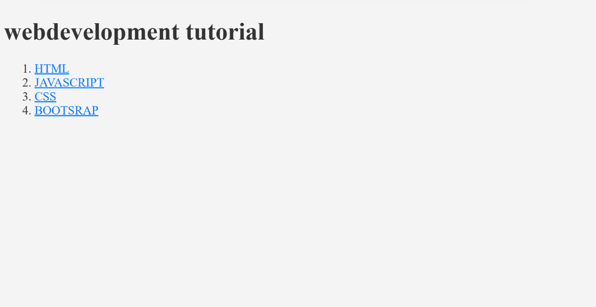
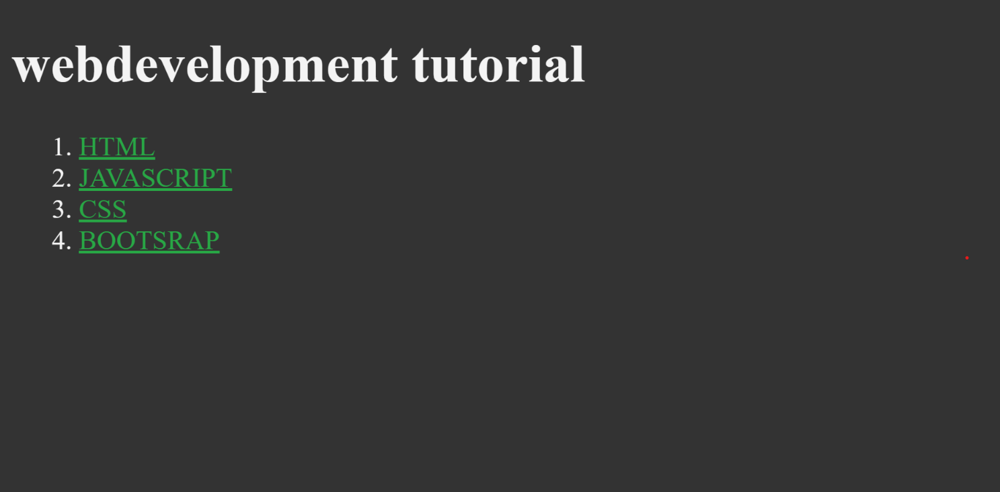
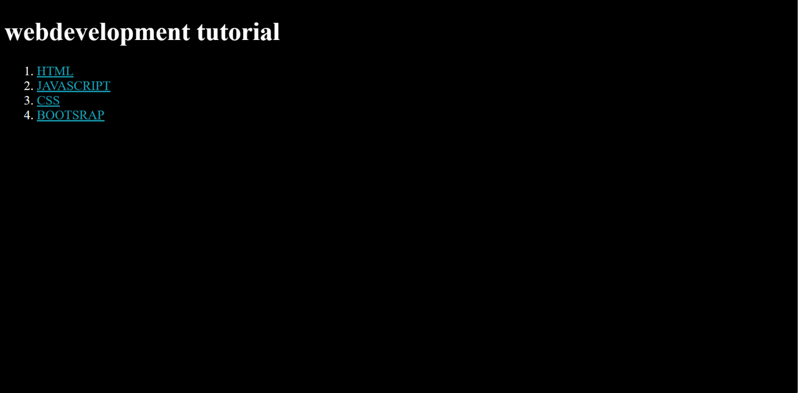
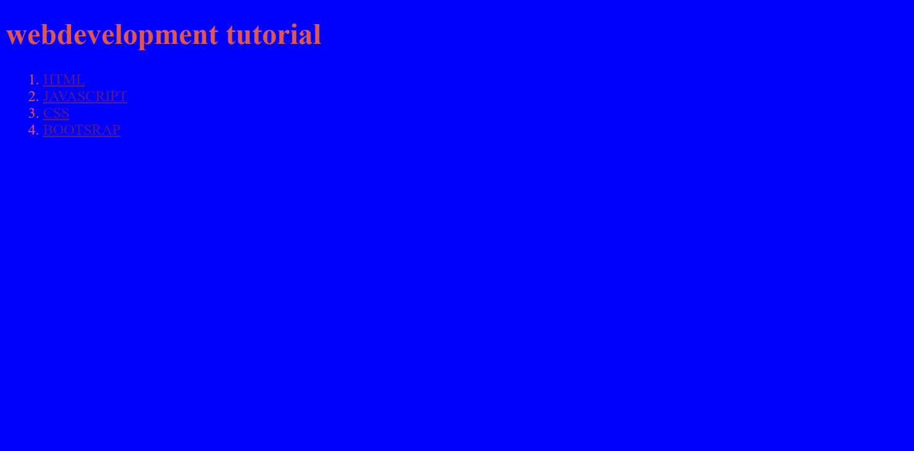
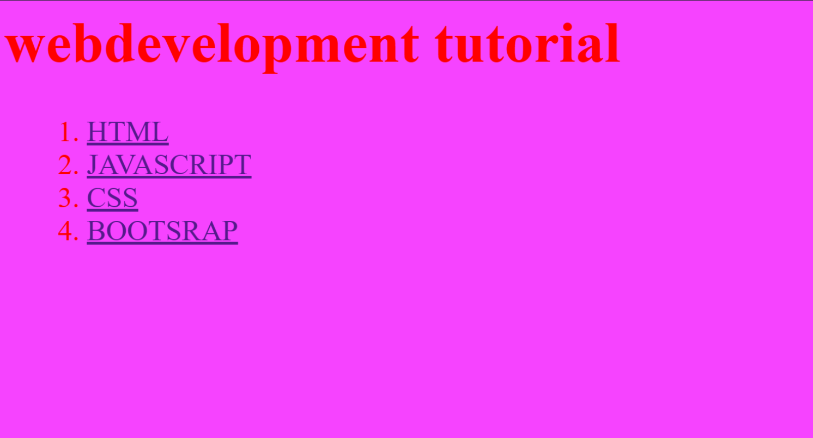
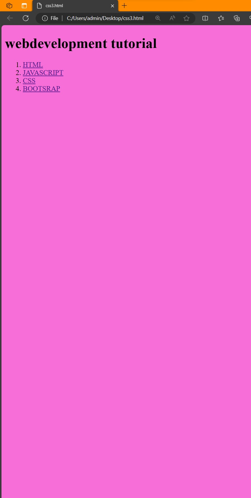
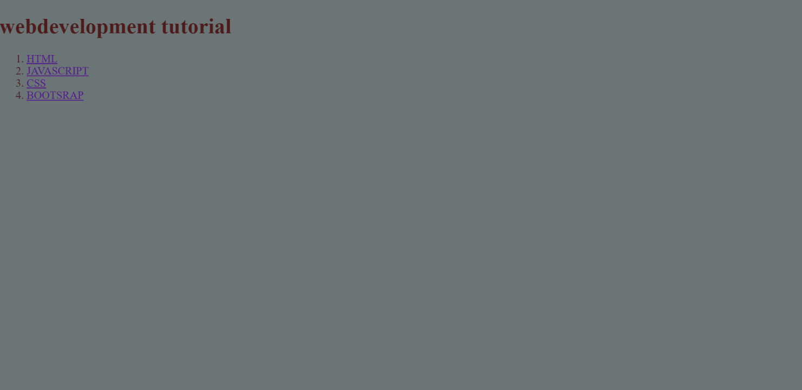
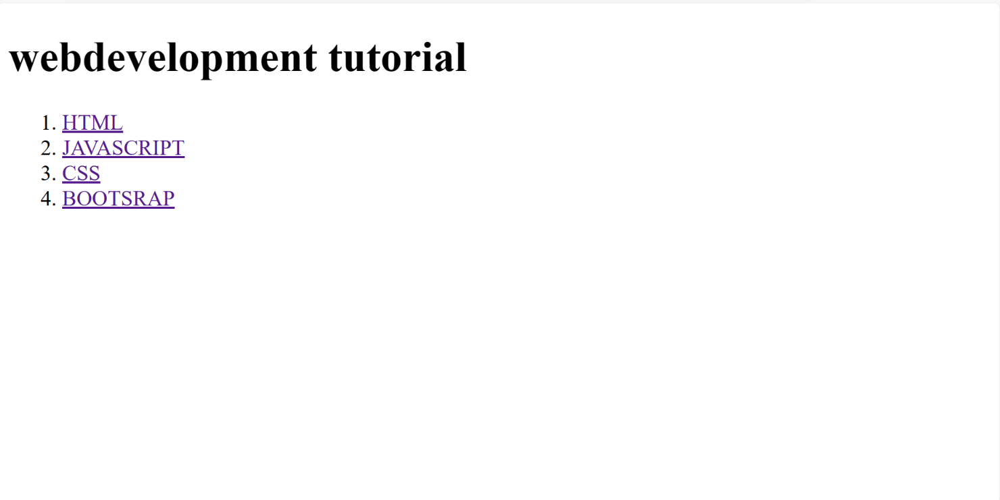
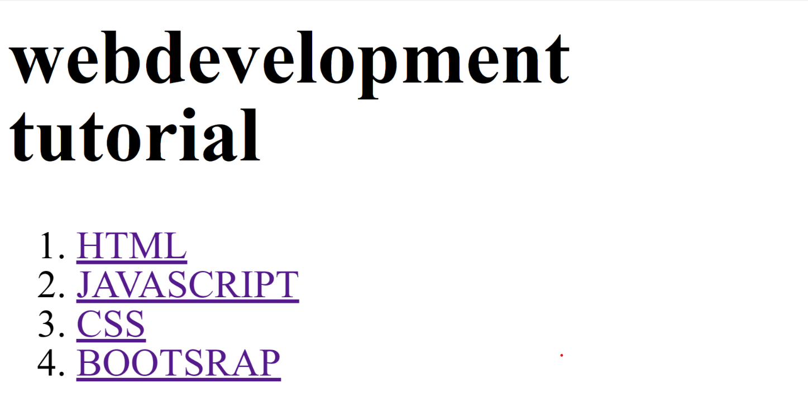
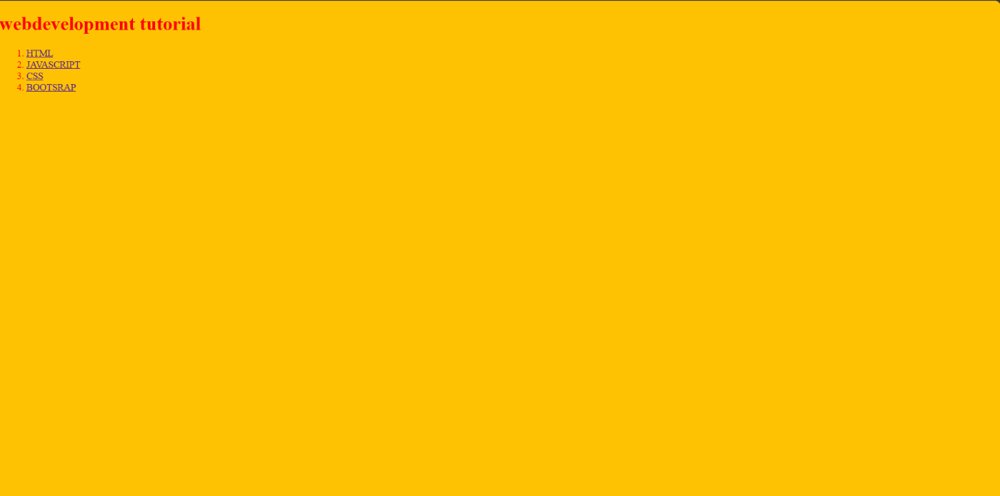

# Ex-07-CSS

# AIM:
(i) Using CSS media queries, modify the webpage's color scheme with the following requirements: Default Color Scheme: Background color: Light gray (#f4f4f4) Text color: Dark gray (#333) Link color: Blue (#007bff) Small Screen Adaptation (Max-width: 600px): Change the background color to dark gray (#333) Change the text color to light gray (#f4f4f4) Change the link color to light green (#28a745) Dark Mode Preference: If the user has set their device to dark mode, override the above styles with the following: Background color: Black (#000) Text color: White (#fff) Link color: Cyan (#17a2b8) Deliverable: Write the CSS code that implements the above requirements. Your code should include the base styles and the appropriate media queries for small screens and dark mode preference.

# DESIGN STEPS :
Step 1 : Create HTML Structure
Create the HTML structure for your webpage.

Step 2 : Set Default Styles
In your CSS file define the default color scheme for the webpage.

Step 3 : Implement Small Screen Adaptation
Within your CSS file, use a media query to adjust styles for small screens (max-width: 600px).

Step 4 : Implement Dark Mode Preference
Still in your CSS file, apply another media query to override styles for devices set to dark mode.

Step 5 : Add Content
In your HTML file, add your webpage content within the 'body' tags.

Step 6 : End the code
End the html code by closing all the open tages.

# CODE: 7(i)
```
<!Doctype html>
<html>
<head>
<style>
body {
 background-color: #f4f4f4;
 color: #333;
}
a{
color: #007bff;
}
@media screen and (max-width: 600px) 
{
	body{
          background-color: #333;
          color: #f4f4f4;

}
a{
color: #28a745;
}
}
@media(prefers-color-scheme:dark)
{
body
{
background-color: #000;
color: #fff;
}
a
{
color: #17a2b8;
}
}

</style>
</head>
<body>
<h1>webdevelopment tutorial</h1>
<ol>
<li><a href="https://www.w3schools.com/html/">HTML</a></li>
<li><a href="https://www.w3schools.com/js/default.asp">JAVASCRIPT<a/></li>
<li><a href="https://www.w3schools.com/css/default.asp">CSS</a></li>
<li><a href="https://www.w3schools.com/bootstrap/bootstrap_ver.asp">BOOTSRAP</a></li>
</ol>
</body>
</html>

```
# OUTPUT




# EX-07(ii)-CSS
# AIM:
To use a media query in CSS to apply different styles to a webpage for mobile devices (with widths less than 600px) and desktop devices (with widths greater than or equal to 600px)? Provide an example CSS snippet to demonstrate your answer.

# DESIGN STEPS :EX-7(ii)
Step 1 : Create HTML Structure
Create the HTML code with root element.

Step 2 :Define Default Styles
Set the default styles for your webpage that will be applied to all devices.

Step 3 : Apply Media Query for Mobile Devices (Max-width: 600px)
Use a media query to adjust styles as needed for a mobile-friendly layout.

Step 4 : Apply Media Query for Desktop Devices (Min-width: 601px)
Use another media query to adjust styles for a larger screen.

Step 5 : End the code
End the html code by closing all the open tages.

# CODE:7(ii)
```
<!Doctype html>
<html>
<head>
<style>
@media screen and (max-width: 599px) 
{
	body{
          background-color: #F643FF;
          color: red;
	  font-size: 14px;

}
}
@media screen and(min-width: 600px)
{
body
{
background-color: blue;
color: #DF5755;
font-size=16px;
}
}

</style>
</head>
<body>
<h1>webdevelopment tutorial</h1>
<ol>
<li><a href="https://www.w3schools.com/html/">HTML</a></li>
<li><a href="https://www.w3schools.com/js/default.asp">JAVASCRIPT<a/></li>
<li><a href="https://www.w3schools.com/css/default.asp">CSS</a></li>
<li><a href="https://www.w3schools.com/bootstrap/bootstrap_ver.asp">BOOTSRAP</a></li>
</ol>
</body>
</html>

```
# OUTPUT: 7(ii)



# EX-07(iii)-CSS

# AIM:
To know you can use CSS media queries to apply different styles based on the orientation (landscape or portrait) of the device. Provide a CSS example where you change the background color of the body based on the orientation.
STEP1:
create a html code by entering basic root tags

STEP2:
use media queries and add the needed orientation there

STEP3:
After selecting the screen method then type and then (orientation: your required orientation) if you want portrait you can add there

STEP4:
Type portrait and landscape there

STEP5:
Enter the required style for it

STEP6:
Run the html code in both landscape and portrait mode

# CODE:7(iii)
```
<!Doctype html>
<html>
<head>
<style>
@media only screen and (orientation: portrait) {
	body{
          background-color: #F86ED9;
          color: black;
	 

 }
}
@media only screen and (orientation: landscape) {
  body {
background-color: #6B7576;
color: #4D1B1B;

  }
}

</style>
</head>
<body>
<h1>webdevelopment tutorial</h1>
<ol>
<li><a href="https://www.w3schools.com/html/">HTML</a></li>
<li><a href="https://www.w3schools.com/js/default.asp">JAVASCRIPT<a/></li>
<li><a href="https://www.w3schools.com/css/default.asp">CSS</a></li>
<li><a href="https://www.w3schools.com/bootstrap/bootstrap_ver.asp">BOOTSRAP</a></li>
</ol>
</body>
</html>
```
# OUTPUT:



# EX-07-CSS:7(iv)
# AIM:
TO Describe how you would use media queries to adjust typography (like font size and line spacing) on a website to improve readability across different device sizes, from mobile phones to large desktop monitors. Include a CSS code snippet in your explanation.

# DESIGN STEPS:
STEP1:
Include media queries

STEP2:
Enter the required widtth based on your required devices

STEP3:
Type media queries separately for the devices you are looking for,i gave the code for 3 devices.

STEP4:
Then enter the font size and line height as your wish ,in benefit of the user.

STEP5:
Run this html code in browser and observe the changes when you change the size of your desktop

STEP6:
Take screenshots of the outputs and upload it

CODE:7(iv)
```
<!Doctype html>
<html>
<head>
<style>
@media screen and (max-width: 499px) 
{
	body{
	  font-size: 23px;
	  line-height:1;

}
}
@media screen and (min-width: 639px)
{
body
{
font-size=20px;
line-height=1;
}
}
@media screen and (min-width: 900)
{
body
{
font-size:15px;
line-height=1;
}
}
</style>
</head>
<body>
<h1>webdevelopment tutorial</h1>
<ol>
<li><a href="https://www.w3schools.com/html/">HTML</a></li>
<li><a href="https://www.w3schools.com/js/default.asp">JAVASCRIPT<a/></li>
<li><a href="https://www.w3schools.com/css/default.asp">CSS</a></li>
<li><a href="https://www.w3schools.com/bootstrap/bootstrap_ver.asp">BOOTSRAP</a></li>
</ol>
</body>
</html>
```

# OUTPUT:




# EX-07(V)-CSS:
# AIM:
Media queries can be used to provide print-friendly styles for web pages. How would you use a media query to change the styling of a webpage when it is printed, such as changing the background to white and hiding non-essential elements? Provide a CSS example.

# DESIGN STEPS:
Step 1 : Create HTML Structure
Create the HTML code with root element.

Step 2 : Set Default Styles
Define the default styles for your webpage.

Step 3 : Apply Media Query for Print Styles
Use a media query (@media print) to modify the appearance of the page when it's printed.

Step 4 : End the code
End the html code by closing all the open tages.
```
<html>
<head>
<title>Question 05</title>
<style>
    div, li {
        font-size: 14px;
        line-height: 1;
    }

    @media print {
        body {
            background-color: white;
        }

        div, li {
            font-size: 12px;
            line-height: 1.4;
        }

        
        .non-essential {
            display: none;
        }
    }
</style>
</head>
<body>
    <div>
    webdevelopment
  </div>
    <ol>
<li><a href="https://www.w3schools.com/html/">HTML</a></li>
<li><a href="https://www.w3schools.com/js/default.asp">JAVASCRIPT<a/></li>
<li><a href="https://www.w3schools.com/css/default.asp">CSS</a></li>
<li><a href="https://www.w3schools.com/bootstrap/bootstrap_ver.asp">BOOTSRAP</a></li>
</ol>
  </body>
  </html>
```  
# OUTPUT:


# EX-07(vi)-CSS:
# AIM:
With the increasing popularity of dark mode in user interfaces, explain how you would use a media query to detect if the user has set their system to prefer a dark color scheme. Provide an example of how you would change the background and text colors of a website based on this preference.

# DESIGN STEPS:
STEP1:
Use the prefers-color-scheme media feature, which is used to detect if the user has requested the system use a light or dark color theme.

STEP2:
The prefers-color-scheme media feature can have the values light, dark, or no-preference.

STEP3:
use media queries and apply variety of styles that the user prefers

step4:
set a colour for dark theme

STEP5:
set a colour for light theme

STEP6:
enter the required details and links in between the body tag

step7:
run this code in both light and dark theme


# CODE:7(Vi)
```
<!Doctype html>
<html>
<head>
<style>
@media screen and (prefers-color-scheme:dark) 
{
	body{
          background-color: #FFC203;
          color: red;
	  font-size: 14px;

}
}
@media screen and (prefers-color-scheme:light)
{
body
{
background-color: #03FF5B;
color: #DF5755;
font-size=16px;
}
}

</style>
</head>
<body>
<h1>webdevelopment tutorial</h1>
<ol>
<li><a href="https://www.w3schools.com/html/">HTML</a></li>
<li><a href="https://www.w3schools.com/js/default.asp">JAVASCRIPT<a/></li>
<li><a href="https://www.w3schools.com/css/default.asp">CSS</a></li>
<li><a href="https://www.w3schools.com/bootstrap/bootstrap_ver.asp">BOOTSRAP</a></li>
</ol>
</body>
</html>
```
# OUTPUT:



